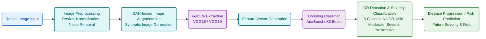

# Diabetic Retinopathy Detection Pipeline System Architecture

```mermaid
graph LR
    %% Nodes
    Input(Retinal Image Input)
    Preproc(Image Preprocessing<br/>Resize, Normalization, Noise Removal)
    Augment(GAN-based Image Augmentation<br/>Synthetic Image Generation)
    Extract(Feature Extraction<br/>VGG16 / VGG19)
    Vector(Feature Vector Generation)
    Classify(Boosting Classifier<br/>AdaBoost / XGBoost)
    detect(DR Detection & Severity Classification<br/>5 Classes: No DR, Mild, Moderate, Severe, Proliferative)
    Predict(Disease Progression / Risk Prediction<br/>Future Severity & Risk)

    %% Flow
    Input --> Preproc
    Preproc --> Augment
    Augment --> Extract
    Extract --> Vector
    Vector --> Classify
    Classify --> detect
    detect --> Predict

    %% Styling
    classDef input fill:#e3f2fd,stroke:#1565c0,stroke-width:2px,color:#0d47a1;
    classDef process fill:#e0f7fa,stroke:#006064,stroke-width:2px,color:#006064;
    classDef model fill:#f3e5f5,stroke:#7b1fa2,stroke-width:2px,color:#4a148c;
    classDef output fill:#e8f5e9,stroke:#2e7d32,stroke-width:2px,color:#1b5e20;

    class Input input;
    class Preproc,Augment,Vector process;
    class Extract,Classify model;
    class detect,Predict output;
```
